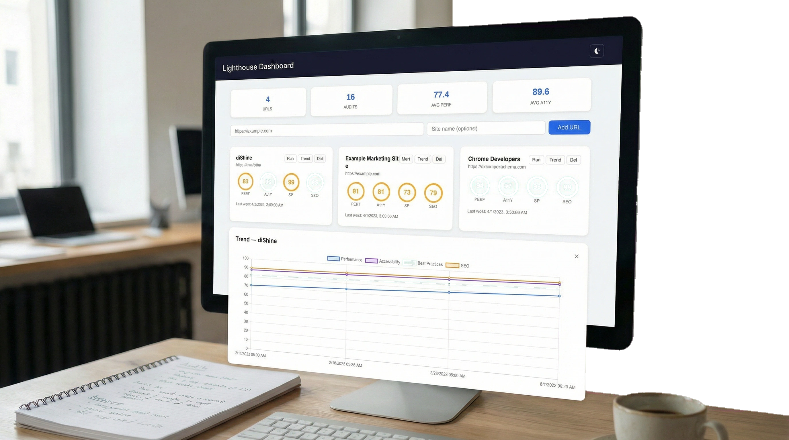
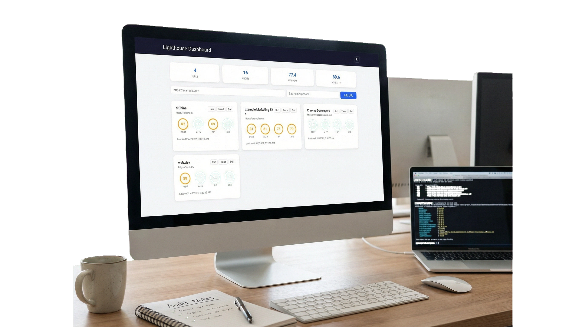
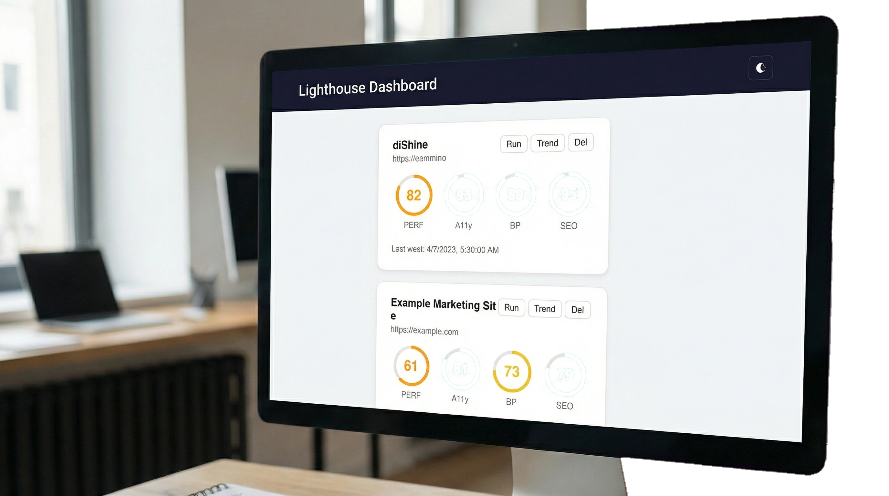

# ⚡️ Lighthouse Dashboard: self-hosted dashboard to automate your web performance monitoring

<div align="center">
  
[](https://dishine.it/)

***Transform. Automate. Shine!***

[](https://dishine.it/blog/lighthouse-dashboard-self-hosted-performance-monitoring/)
[](https://linkedin.com/company/100682596)
[]()
[](LICENSE)

<p align="center">
  
</p>

***Stop running manual [Lighthouse](https://developer.chrome.com/docs/lighthouse/) checks. This self-hosted dashboard automates your web performance monitoring: it runs scheduled audits in the background, logs the results in a local SQLite database, and serves a clean web UI with historical trend charts to help you catch performance regressions before your users do. 
Runs  audits on a schedule, stores results in a local SQLite database, and serves a web dashboard with score cards and trend charts.***

Built by [diShine Digital Agency](https://dishine.it). Read more on the [diShine blog](https://dishine.it/blog/lighthouse-dashboard-self-hosted-performance-monitoring/).

</div>

<p align="center">
  
  
</p>

---

## Quick start

```bash
# Install the dashboard
npm install @dishine/lighthouse-dashboard

# Install Lighthouse (peer dependency)
npm install lighthouse

# Start the server
npx lighthouse-dashboard start

# Open http://localhost:3000
```

---

## Features

- **Scheduled audits** — runs automatically at a configurable interval (default: 24 hours).
- **Score tracking** — stores performance, accessibility, best practices, and SEO scores in SQLite.
- **Performance budgets** — set minimum score thresholds per URL; the dashboard flags scores that fall below the budget.
- **Trend charts** — shows how scores change over time using Chart.js.
- **Audit export** — download audit history as JSON or CSV.
- **Webhook notifications** — receive a POST request with audit results and budget failures after each audit.
- **Web dashboard** — responsive UI with dark mode support, served at `localhost`.
- **REST API** — every dashboard action is available over HTTP.
- **CLI** — manage URLs and run one-off audits from the terminal.

---

## CLI commands

| Command | Description |
|---------|-------------|
| `start` | Start the dashboard server |
| `run <url>` | Run a single Lighthouse audit and print results |
| `add <url> [name]` | Add a URL to scheduled monitoring |
| `list` | List all monitored URLs |
| `remove <id>` | Remove a URL by its ID |
| `--help` | Show usage information |
| `--version` | Show version number |

### Start options

| Flag | Default | Description |
|------|---------|-------------|
| `--port` | `3000` | Server port |
| `--db` | `./lighthouse.db` | Path to SQLite database file |
| `--interval` | `86400` | Audit interval in seconds |

---

## API endpoints

| Method | Endpoint | Description |
|--------|----------|-------------|
| GET | `/api/urls` | List all URLs with latest audit data |
| POST | `/api/urls` | Add a URL (`{ url, name }`) |
| PATCH | `/api/urls/:id` | Update name, budgets, or webhook URL |
| DELETE | `/api/urls/:id` | Remove a URL and its audits |
| GET | `/api/urls/:id/audits` | Get audit history (`?limit=50`) |
| GET | `/api/urls/:id/trend` | Get trend data (`?days=30`) |
| GET | `/api/urls/:id/export` | Export audits as JSON or CSV (`?format=csv`) |
| POST | `/api/urls/:id/run` | Trigger an audit |
| GET | `/api/stats` | Dashboard statistics |
| GET | `/api/health` | Health check |

---

## Programmatic usage

```javascript
import { createServer } from '@dishine/lighthouse-dashboard';

const { app, server, db, scheduler } = createServer({
  port: 8080,
  dbPath: '/data/lighthouse.db',
  interval: 3600000, // 1 hour in ms
});
```

Individual modules can also be imported:

```javascript
import { DB, runAudit, Scheduler, createRouter } from '@dishine/lighthouse-dashboard';

const db = new DB('./audits.db');
db.addUrl('https://example.com', 'Example');

const result = await runAudit('https://example.com');
db.saveAudit(1, {
  performance: result.performance,
  accessibility: result.accessibility,
  bestPractices: result.bestPractices,
  seo: result.seo,
  ...result.metrics,
});
```

---

## Performance budgets

Set minimum score thresholds per URL. When an audit score falls below its budget, the dashboard highlights it with a pulsing red indicator.

```bash
# Set budgets via API
curl -X PATCH http://localhost:3000/api/urls/1 \
  -H "Content-Type: application/json" \
  -d '{"budget_performance": 90, "budget_accessibility": 85, "budget_seo": 80}'
```

You can also set budgets from the dashboard UI by clicking the **Budget** button on any URL card.

---

## Webhooks

Configure a webhook URL to receive a POST request after each audit completes. The payload includes the audit results and any budget failures.

```bash
# Set a webhook URL
curl -X PATCH http://localhost:3000/api/urls/1 \
  -H "Content-Type: application/json" \
  -d '{"webhook_url": "https://hooks.slack.com/services/..."}'
```

Webhook payload:

```json
{
  "event": "audit.completed",
  "url": "https://example.com",
  "name": "Example",
  "audit": { "performance": 92, "accessibility": 88, "best_practices": 95, "seo": 100, "..." },
  "budgetFailures": [
    { "category": "Accessibility", "score": 88, "budget": 90 }
  ]
}
```

To remove a webhook, set it to `null`:

```bash
curl -X PATCH http://localhost:3000/api/urls/1 \
  -H "Content-Type: application/json" \
  -d '{"webhook_url": null}'
```

---

## Exporting data

Download audit history as JSON or CSV:

```bash
# JSON export (default)
curl http://localhost:3000/api/urls/1/export

# CSV export
curl http://localhost:3000/api/urls/1/export?format=csv -o audits.csv
```

---

## Self-hosting

### With pm2

```bash
pm2 start npx --name lighthouse-dashboard -- lighthouse-dashboard start --port 3000
pm2 save
pm2 startup
```

### With systemd

```ini
[Unit]
Description=Lighthouse Dashboard
After=network.target

[Service]
Type=simple
User=www-data
WorkingDirectory=/opt/lighthouse-dashboard
ExecStart=/usr/bin/node bin/cli.js start --port 3000 --db /data/lighthouse.db
Restart=on-failure

[Install]
WantedBy=multi-user.target
```

The SQLite database is a single file — back it up by copying it.

---

## Requirements

- **Node.js** 18 or later
- **Google Chrome** or **Chromium** (Lighthouse runs audits in a headless browser)
- **lighthouse** ≥ 12.0.0 (peer dependency)

---

## Contributing

See [CONTRIBUTING.md](CONTRIBUTING.md).

## Security

See [SECURITY.md](SECURITY.md).

## License

MIT — see [LICENSE](LICENSE) for details.

---

## About diShine

[diShine](https://dishine.it) is a creative tech agency based in Milan. We create digital strategies, design process and build tools for clients, help businesses with AI strategy and MarTech architecture, and open-source some things we wish existed.

- Web: [dishine.it](https://dishine.it)
- GitHub: [github.com/diShine-digital-agency](https://github.com/diShine-digital-agency)
- Contact: kevin@dishine.it

